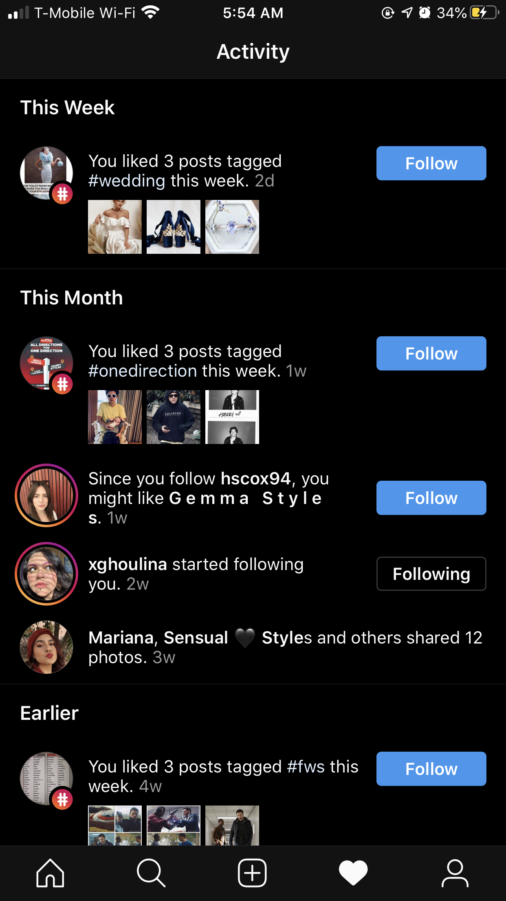
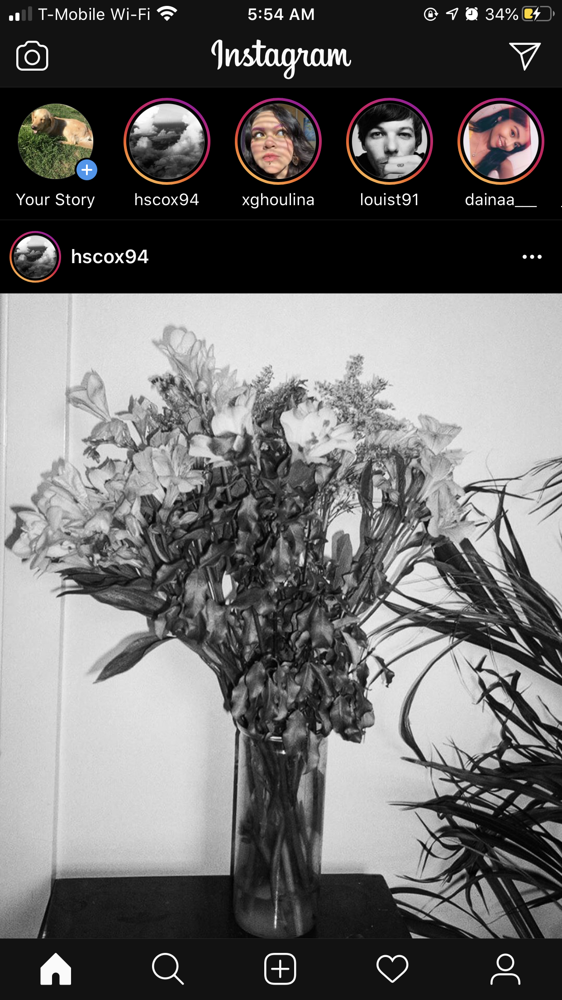
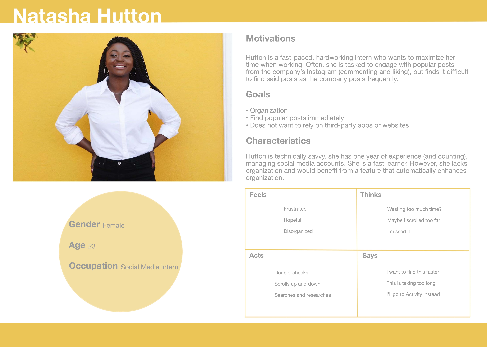
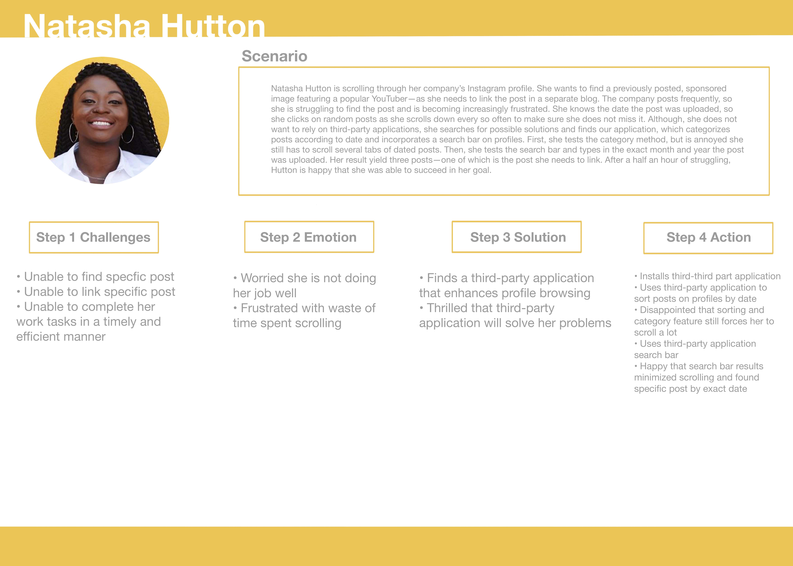
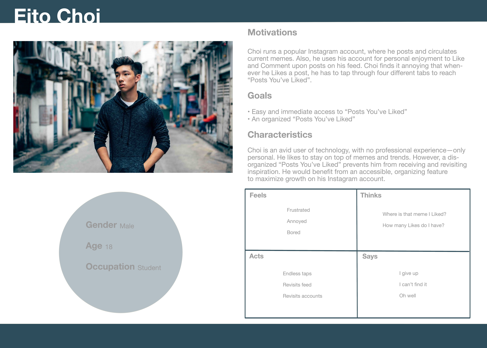
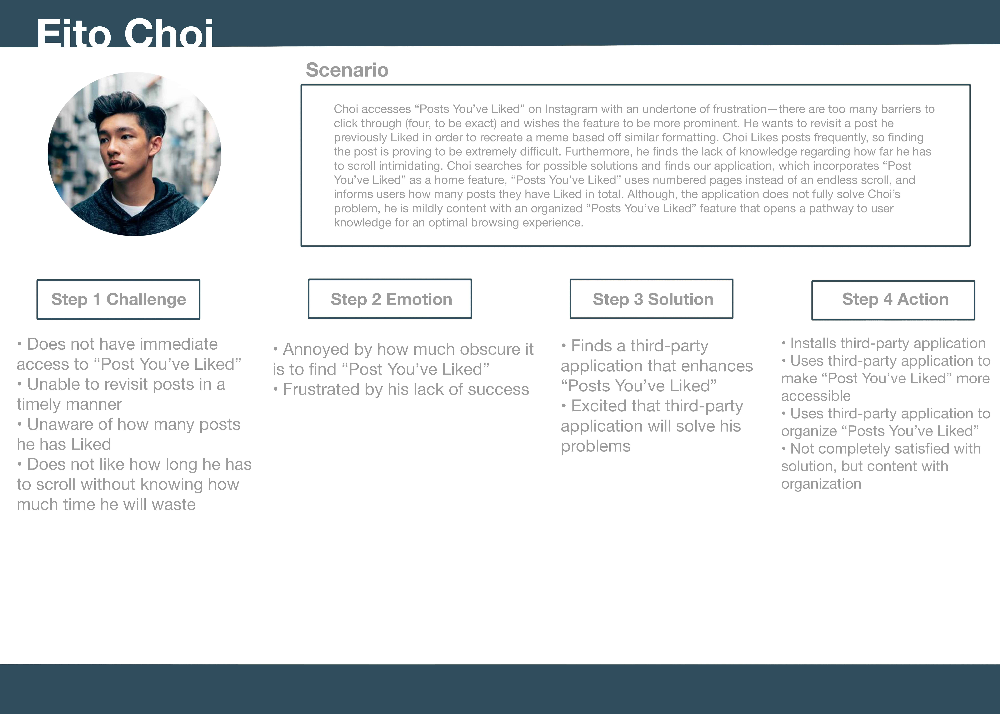
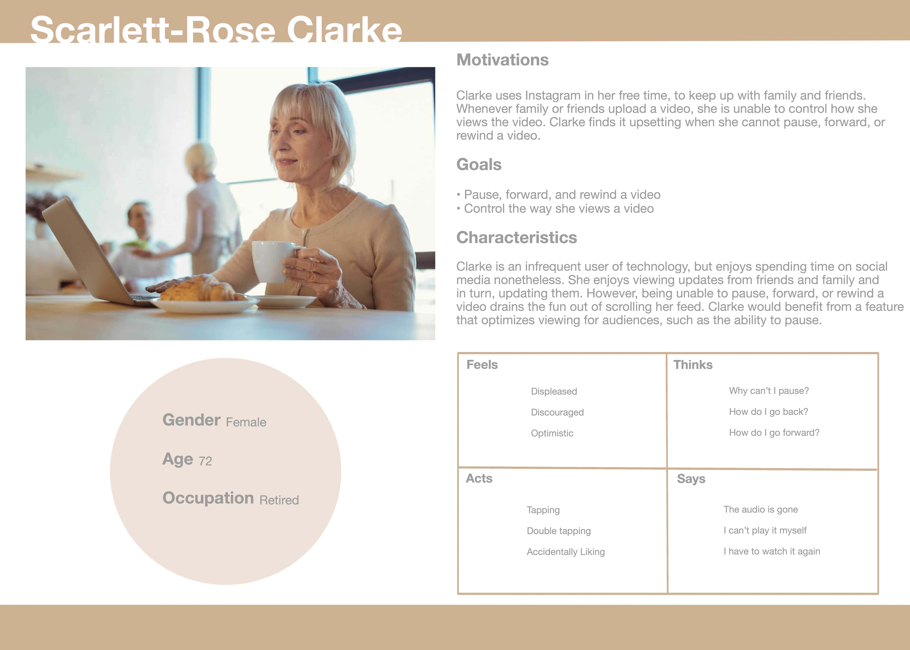
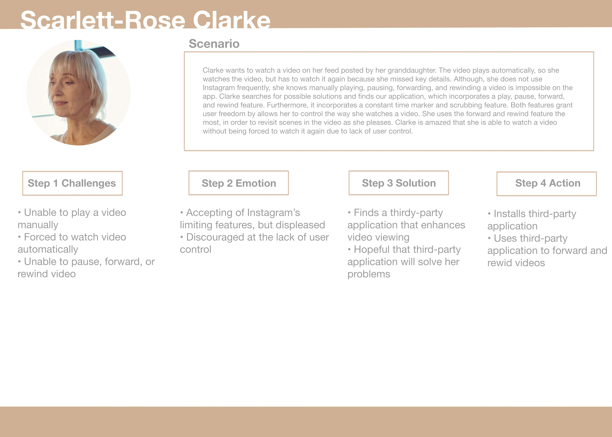

# UPLOADIT
## DH 150 2020W Kimberly Jimenez

### Introduction

UPLOADIT is a novel UX design of a mobile app that produces a user accessible experience of image sharing, image viewing, video viewing, and Liking (an important part of sharing and viewing content). Current social media applications that prioritize image sharing forgo to prioritize subsequent aspects, such as, the ease of viewing and Liking images or videos. UPLOADIT prioritizes all aspects of image sharing and allows for a more advanced and organized experience. This is done so through the key features of the app, which include dated tabs to categorize images on profiles, a developed “Likes” page in navigation, and video control buttons. The application, though advanced in its features, remains simple to use for all users alike. More specifically, it is for users who enjoy social media, art, photography, image sharing, but want to enjoy a thorough experience that allows for rewatching, reviewing, and revisiting.

### Design Statement

My goal of the project was to resolve the lack of user control and freedom as well as to improve accessibility to key features of social media applications. Solving the problems aforementioned is important because I hope to produce an experience of image sharing that is worthwhile, easy to navigate, less frustrating, and not time consuming. Furthermore, I would like for my mobile application to leave users satisfied with its efficiency, knowing the layout and design of the application is organized with their experiened in mind.

### Competitor Analysis

#### Heuristic Evaluation

I chose to focus on one popular social media platform, Instagram (available to download here), in order to conduct a heuristic evaluation based off of Jakob Nielsen’s “10 Usability Heuristics for User Interface Design” and gain insight into what issues needed to be resolved. [read more...](https://github.com/kj121497/kj)

###### Instgram
  

### Competitor Analysis

#### Usability Testing

I conducted a usability test to understand the extent of user freedom and how accessible Instagram currently is. My participant is a friend, a college senior, who has used Instgram in the past, but no longer uses it. Though he does not use Instgram, he is familiar with the way social media applications work. Thus, I thought he would be a perfect participant to gauge the way in which a user that is both familiar and unfamiliar with the app navigates it. 

He performed three tasks. The first task included steps to test how users accessed their Likes page. The second task included steps to test if a user was able to control the way they watched a video. The third task included steps to test if a user could control the way they uploaded an image. My participant was not able to thoroughly perform each task, leading him to unsatisfied with his application experience; thus, alerting me Instagram needed to improve. [read more...](https://github.com/kj121497/kj2)

### User Research 

Though I was able to learn a lot from usability testing, I needed to know more information about how a different user navigates Instagram and what their thoughts were on an (slightly) updated set of usability tasks I had come up with. My participant was a friend, another college senior, who is an advanced user of Instagram. Thus, she would be familiar with the problems I would pose. I interviewed to learn how she would utilize Instagram to find old or specific posts on profile pages and her “Posts You’ve Liked” page. Most notably, she observed the endless scrolling was a feature she was unsatisfied with, which allowed me to design a Likes page with this thought in mind. [read more...](https://github.com/kj121497/kj3)

### UX Storytelling

I created my personas based off of experience with Instgram to gauge the needs of familiar and unfamiliar users.

#### Persona 1

###### Journey Map

#### Persona 2

 

###### Journey Map

#### Persona 3

###### Journey Map

[read more...](https://github.com/kj121497/kj4)

### Graphic Design Element Variations

In this assigment, I learned how to create accessible color schemes and how to audit those color schemes to test accessbility. [read more...](https://github.com/kj121497/assignment7) 

### Low-Fidelity Prototype (Wireframes, Wireflow, and Testing)

From usability testing, user research, and personas and scenarios, I created a low-fidelity prototype (which includes wireframes and a wireflow) to lay out three different tasks. The first task maps out a search bar and date tabs within Profiles. The second task maps out number of pages, number of Likes, and a Likes page incorporated as a navigation feature. The third task maps out video control buttons. [read more...](https://github.com/kj121497/kj5)

### High-Fidelity Prototype

### Pitch Video

### Conclusion
